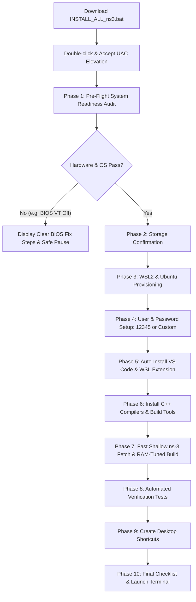

# ns-3 Automated One-Click Setup for Windows 10 & 11

[-blue?logo=windows&logoColor=white)](https://microsoft.com)
[](https://ubuntu.com)
[](https://www.nsnam.org)
[](https://code.visualstudio.com)
[](https://github.com/qamarabbas-024)

> **Prepared with care for BSCS Batch 2025–2029 | Computer Networks Lab (Lab 01)**  
> *Facilitated and engineered by Qamar Abbas*

An autonomous, 100% self-contained one-click installer (`INSTALL_ALL_ns3.bat`) that prepares, configures, compiles, and verifies the complete **ns-3 Network Simulation Environment** on Windows 10 and Windows 11 machines.

---

## 🎯 The Problems This Tool Solves for Students

Setting up ns-3 on Windows has historically been one of the most frustrating hurdles for computer science students. In a typical class of 50+ students, 70–80% run into blocking technical errors. This tool eliminates all of them:

| # | Common Student Problem | Why It Happened | How This Installer Fixes It |
|---|---|---|---|
| **1** | **Terminal Vanished on Keypress** | Older scripts used `pause >nul` followed by `exit /b` on error or elevation. Double-clicking the file caused the window to vanish instantly without letting students read what happened. | Employs an **Anti-Vanishing Guard** with `cmd.exe /k`, comprehensive error trapping, and safe pauses so the terminal window never closes unexpectedly. |
| **2** | **Windows 11 "Smart App Control" Block** | Downloaded files from WhatsApp/Drive attach the NTFS `Zone.Identifier` ("Mark of the Web"), causing Windows 11 SAC to block execution with no "Run anyway" button. | Built-in **Self-Unblocking** via PowerShell `Unblock-File` and clear 10-second student instructions for systems with strict pre-launch policies. |
| **3** | **Windows 10 vs. Windows 11 Differences** | Modern `wsl --install` is missing or unrecognized on older Windows 10 builds (`< 19041`). | Automatically audits the Windows build number and falls back to native Windows DISM feature enablement (`Microsoft-Windows-Subsystem-Linux` and `VirtualMachinePlatform`). |
| **4** | **BIOS Virtualization (VT-x / AMD-V) Disabled** | Budget laptops (HP, Dell, Lenovo, Asus, Acer) often ship with hardware virtualization disabled in BIOS, causing WSL2 to fail with error `0x80370102`. | Runs a **Pre-Flight Hardware Check** *before* doing anything, immediately detecting if virtualization is off and providing brand-specific BIOS key instructions. |
| **5** | **Laptop Freezing / Out-of-Memory (OOM)** | Standard `./ns3 build` compiles 4,000+ objects across all CPU cores. On laptops with 4–8 GB RAM, `g++` consumes all memory, thrashing the disk and freezing the system. | **Auto-tunes compilation concurrency** based on detected RAM: throttles to `-j 2` on 4GB systems and `-j 4` on 8GB systems to prevent overheating and freezing. |
| **6** | **Laptop Falling Asleep Mid-Compilation** | Compiling C++ takes 10–15 minutes. Windows battery profiles put laptops to sleep after 5 minutes of no keyboard touch, terminating the build. | Uses Windows API (`SetThreadExecutionState`) to **temporarily prevent sleep** while compiling, restoring normal power saving when finished. |
| **7** | **Uninitialized Ubuntu & Sudo Deadlocks** | Fresh WSL distros have no default user and prompt for passwords during non-interactive script runs, hanging indefinitely. | Directly provisions packages via `wsl -u root` and offers an automatic default password (`12345`) with passwordless sudo for lab exercises. |
| **8** | **Missing Visual Studio Code** | Many students do not have VS Code or installed it without checking "Add to PATH", causing `code .` to fail. | **Automatically downloads and installs official VS Code silently** from Microsoft CDN, configures PATH, and installs the Remote WSL extension. |
| **9** | **Massive Download Sizes & Stalling** | Full Git history of `ns-3-dev` is ~2 GB and stalls on slow home/campus Wi-Fi. | Uses a **shallow clone (`--depth 1`)**, reducing download size to only ~50 MB and finishing in ~1 minute. |

---

## 🚀 Key Features

- **Single-File Standalone Architecture:** You only need to share or download one file: `INSTALL_ALL_ns3.bat`. Zero external `.sh` or `.py` files required.
- **Pre-Flight System Readiness Audit:** Inspects OS, 64-bit architecture, BIOS virtualization, RAM, free disk space (>= 15 GB), and internet connectivity before touching the system.
- **Real-Time Visual Feedback:** Ninja compilation counters and live download progress ensure students always see activity on screen.
- **Auto-Generated Desktop Shortcuts:** Automatically creates clean 1-click desktop shortcuts:
  - 🖥️ **`ns-3 Linux Terminal`**
  - 💻 **`ns-3 VS Code`**
- **Built-in Control Center:** Once installed, re-running `INSTALL_ALL_ns3.bat` opens an interactive management menu (launch terminal, open VS Code, run Lab 1 simulations, recompile, or repair).

---

## 📋 Installation Workflow



---

## 💻 Quick Start Guide for Students

### Step 1: Download
Download `INSTALL_ALL_ns3.bat` from this repository or the WhatsApp group. Save it anywhere on your laptop (any drive or folder).

### Step 2: Unblock (If Prompted by Windows Smart App Control)
If Windows 11 displays a blue security popup:
1. **Right-click** `INSTALL_ALL_ns3.bat` ➔ Click **Properties**.
2. At the bottom of the **General** tab, check the **"Unblock"** box.
3. Click **Apply**, then **OK**.

### Step 3: Run the Installer
1. **Double-click** `INSTALL_ALL_ns3.bat`.
2. Click **"YES"** on the Windows Administrator (UAC) prompt.
3. The installer will audit your system and guide you through the automated setup.

---

## 🧪 Included Verification Simulations

The installer automatically verifies the setup using the official ns-3 tutorial test suite:

### 1. Smoke Test (`hello-simulator`)
```bash
./ns3 run hello-simulator
```
**Expected Output:**
```text
Hello Simulator
```

### 2. Lab 1 Tutorial Test (`first.cc`)
Simulates a two-node point-to-point network transmitting 1024-byte packets:
```bash
./ns3 run examples/tutorial/first
```
**Expected Output:**
```text
At time +2s client sent 1024 bytes to 10.1.1.2 port 9
At time +2.00369s server received 1024 bytes from 10.1.1.1 port 49153
At time +2.00369s server sent 1024 bytes to 10.1.1.1 port 49153
At time +2.00737s client received 1024 bytes from 10.1.1.2 port 9
```

---

## 🛠️ Subsequent Launches: The ns-3 Control Center

Whenever you double-click `INSTALL_ALL_ns3.bat` after installation, it automatically detects your existing environment and presents the **Simulation Control Center**:

```text
==============================================================================
                    ns-3 SIMULATION CONTROL CENTER
    Computer Networks Lab (Lab 01) - BSCS Department [Semester 3]
     Prepared with care for BSCS Batch 2025-2029 by Qamar Abbas
==============================================================================

  Your ns-3 simulation environment is fully installed and operational!

  Please select an action:
    [1] Launch ns-3 Linux Terminal
    [2] Open ns-3 in Visual Studio Code
    [3] Run Lab 1 Simulation (first.cc)
    [4] Run Smoke Test (hello-simulator)
    [5] Rebuild / Recompile ns-3 Code
    [6] Re-create Desktop Shortcuts
    [7] Reinstall / Repair Environment from Scratch
    [8] Exit
==============================================================================
```

---

## 🔧 BIOS Virtualization Reference Guide

If the Pre-Flight audit indicates that **Hardware Virtualization** is disabled, follow these steps:

1. Turn off your laptop completely.
2. Turn it back on, and immediately press your manufacturer's BIOS key repeatedly:
   - **HP:** `Esc` or `F10`
   - **Dell:** `F2` or `F12`
   - **Lenovo:** `F2` or `Fn + F2`
   - **Asus:** `F2` or `Del`
   - **Acer:** `F2` or `Del`
3. Navigate to **Advanced**, **Configuration**, or **Security**.
4. Locate **Virtualization Technology**, **Intel VT-x**, or **AMD SVM**.
5. Set it to **[Enabled]**.
6. Press `F10` to Save and Exit. Windows will restart, and you can run `INSTALL_ALL_ns3.bat` again!

---

## 📄 License & Attribution

- **Environment:** [Network Simulator 3 (ns-3)](https://www.nsnam.org/) licensed under GNU GPLv2.
- **Author:** Prepared with care for the **BSCS Department (Batch 2025–2029)** by **Qamar Abbas**.
- Intended for educational and laboratory use in academic networking courses.
